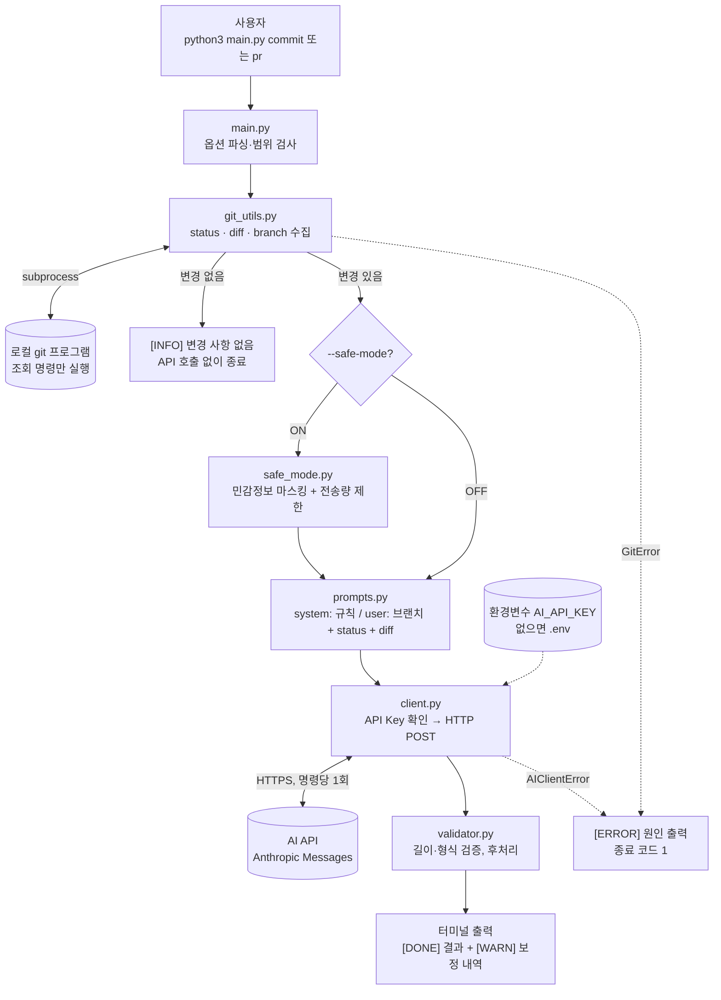

# AI Git 커밋/PR 자동 생성기

내가 바꾼 코드(`git status`, `git diff`)를 AI API에 보내 **커밋 메시지**와 **PR 제목/본문 초안**을 터미널에 출력하는 Python CLI 도구.

- 결과는 **터미널에 출력만** 함. `git commit`, `git push`, PR 생성은 하지 않음
- 생성 결과는 초안이며, 사람이 검토한 뒤 직접 적용함
- 핵심은 API 호출 자체가 아니라 **AI에게 무엇을 어떻게 넘겨야 원하는 품질이 나오는지** 설계하는 것

## 목차
1. [빠른 시작](#빠른-시작)
2. [명령어와 옵션](#명령어와-옵션)
3. [출력 예시](#출력-예시)
4. [동작 방식과 구조](#동작-방식과-구조)
5. [설계 결정](#설계-결정)
6. [safe-mode (민감정보 보호)](#safe-mode-민감정보-보호)
7. [직접 확인해 보기](#직접-확인해-보기)
8. [테스트](#테스트)
9. [주의사항과 한계](#주의사항과-한계)

---

## 빠른 시작

### 요구 사항
- **Python 3.10 이상** (3.9 이하에서는 `TypeError: 'type' object is not subscriptable` 발생. macOS 기본 `python3`가 3.9일 수 있으니 먼저 확인)
- Git
- Anthropic 호환 API Key (Codyssey 게이트웨이 발급 키)
- 외부 패키지 없음 (표준 라이브러리만 사용)

### 설치 및 실행
```bash
python3 --version                  # 3.10 이상인지 확인
git clone https://github.com/0802222/Codyssey-B3-2-AI-API.git
cd Codyssey-B3-2-AI-API

cp .env.example .env               # 열어서 YOUR_KEY를 실제 키로 교체

python3 main.py commit             # 커밋 메시지 생성
python3 main.py pr                 # PR 제목/본문 생성
```

- git 저장소의 **루트**에서 실행함. 다른 프로젝트에 쓰려면 그 프로젝트 루트에서 `python3 /path/to/main.py commit`
- **변경 사항이 있어야** 동작함. 막 clone한 상태에서는 `변경 사항이 없습니다`만 출력됨(정상 동작)
- 새로 만든 파일(untracked)은 `git diff`에 내용이 나오지 않음. `git add <파일>` 후 실행

### API Key와 환경변수
API Key는 코드에 넣지 않고 아래 순서로 찾음.

1. 환경변수 `AI_API_KEY` (CI·테스트처럼 파일을 둘 수 없는 환경용)
2. 이 도구 폴더(`main.py` 옆)의 `.env` 파일

`.env`는 대상 프로젝트가 아니라 **이 도구 폴더**에서 읽으므로, 다른 프로젝트에서 `python3 /path/to/main.py`로 실행해도 키는 한 곳에만 두면 됨. `.env`는 `.gitignore`로 커밋에서 제외됨.

| 이름 | 필수 | 기본값 | 설명 |
|---|---|---|---|
| `AI_API_KEY` | O | - | API Key. 환경변수와 `.env` 모두 없으면 API 호출 전에 오류 출력 후 종료 |
| `AI_API_URL` | X | `https://copa.codyssey.kr/v1/messages` | API 엔드포인트 변경 시 사용 (테스트에서 모의 서버로 교체) |

---

## 명령어와 옵션

| 구분 | 이름 | 기본값 | 설명 |
|---|---|---|---|
| 명령어 | `commit` | - | 커밋 메시지 생성. 제목 1줄(`type: 제목`) + 불릿 본문 |
| 명령어 | `pr` | - | PR 제목 + 본문(Why / What / How to Test) 생성 |
| 옵션 | `--model` | `claude-haiku-4` | 사용할 모델 |
| 옵션 | `--temperature` | `0.3` | 0.0~1.0. 낮을수록 일관됨, 높을수록 다양함 |
| 옵션 | `--max-tokens` | `500` | 응답 길이 상한. 너무 작으면 응답이 잘림 |
| 옵션 | `--safe-mode` | off | 민감정보 마스킹 + diff 전송량 제한 |
| 옵션 | `--max-files` | `10` | safe-mode에서 전송할 최대 파일 수 |
| 옵션 | `--max-lines` | `200` | safe-mode에서 전송할 최대 diff 줄 수 |
| 옵션 | `-h`, `--help` | - | 도움말 출력 |

- 옵션은 `commit`, `pr` 모두에서 사용 가능
- 설정은 저장되지 않음. 매 실행마다 넘긴 옵션, 없으면 기본값이 적용됨. 기본값은 `python3 main.py -h`로 확인
- `--max-files`, `--max-lines`는 `--safe-mode`와 함께일 때만 적용됨
- 명령 1회당 AI API는 **1회만** 호출하고 `[INFO] AI API 호출 횟수: 1회` 로그를 남김 (자동 재시도·재생성 없음)

```bash
python3 main.py commit --safe-mode
python3 main.py pr --model claude-sonnet-4 --temperature 0.2 --max-tokens 800
```

---

## 출력 예시
참고용이며 실제 문구는 매번 다름.

### 커밋 메시지
```
[INFO] Git status 수집 완료: 3개 파일 변경 감지
[INFO] Git diff 수집 완료: 128줄
[INFO] safe-mode OFF: diff 원문이 AI API로 전송됩니다. 민감정보가 있다면 --safe-mode를 사용하세요.
[INFO] AI API 요청 중...
[INFO] AI API 호출 횟수: 1회
[DONE] 커밋 메시지 생성 완료

--- Commit Message ---
feat: git diff 기반 커밋 메시지 자동 생성 추가

- main.py, ai_commit_pr_generator/client.py: AI API 호출 로직 추가
- API Key 미설정 시 안내 메시지 출력
----------------------

※ 생성된 문구는 초안입니다. 검토 후 직접 적용하세요.
```

### PR 초안
```
--- PR Title ---
feat: 커밋/PR 자동 생성 기능 추가

--- PR Body ---
## Why
- 커밋/PR 설명 작성 시간을 줄이고 형식을 통일하기 위함

## What
- git status, git diff 수집 후 AI 입력으로 전달
- commit, pr 명령 구현 및 템플릿 적용

## How to Test
- .env에 AI_API_KEY 설정
- python3 main.py pr 실행 후 Why/What/How to Test 구조 확인
---------------
```

### 오류 / 변경 없음
오류는 traceback 대신 `[ERROR] 원인` 형식으로 stderr에 출력하고 종료 코드 1로 끝남.

| 상황 | 출력 |
|---|---|
| API Key 누락 | `[ERROR] AI_API_KEY가 설정되지 않았습니다.` |
| 잘못된 Key (401) | `[ERROR] API 호출 실패 (HTTP 401): 인증 실패 (AI_API_KEY 확인)` |
| 요청 한도 초과 (429) | `[ERROR] API 호출 실패 (HTTP 429): 요청 한도 초과 (잠시 후 재시도)` |
| 네트워크 오류·타임아웃(60초) | `[ERROR] 네트워크 오류: ...` |
| 변경 사항 없음 | `[INFO] 변경 사항이 없습니다. 커밋 메시지를 생성하지 않고 종료합니다.` (API 호출 안 함) |

---

## 동작 방식과 구조

### 아키텍처

- 실선은 정상 흐름, 점선은 키 읽기와 오류 흐름
- 외부와 통신하는 곳은 `client.py`의 AI API 호출 한 곳뿐이고, git은 이 PC에서만 실행됨

### 처리 흐름
```
main.py                              # CLI 진입점. 아래 1~5단계를 순서대로 호출
ai_commit_pr_generator/git_utils.py  # 1. git 변경 사항 수집
ai_commit_pr_generator/safe_mode.py  # 2. (선택) 민감정보 마스킹, diff 길이 제한
ai_commit_pr_generator/prompts.py    # 3. system 프롬프트(규칙) + user 프롬프트(변경 내용) 구성
ai_commit_pr_generator/client.py     # 4. AI API 호출, 오류를 원인 메시지로 변환
ai_commit_pr_generator/validator.py  # 5. 길이/형식 검증, 후처리 후 출력
tests/                               # 임시 git 저장소 + 모의 API 서버 테스트
```
처음 읽는다면 `main.py`의 `main()` 함수부터 보면 1~5단계 흐름이 한눈에 보임.

1. **수집**: `subprocess`로 이 PC의 git 프로그램을 실행하고 출력을 문자열로 받음 ([자세히](#git-변경-사항을-가져오는-방법-subprocess))
2. **safe-mode (선택)**: diff를 마스킹하고 전송량을 제한
3. **프롬프트 구성**: 고정 규칙은 `system`에, 브랜치명 + status + diff는 `user` 메시지에 넣음
   ```
   현재 브랜치: feat/login

   [git status --short]
    M main.py

   [git diff]
   diff --git a/main.py b/main.py
   ...
   ```
4. **전송**: `urllib.request`로 Anthropic Messages API에 HTTP POST
   - 헤더: `x-api-key: $AI_API_KEY`, `anthropic-version: 2023-06-01`
5. **출력**: 응답을 검증·후처리한 뒤 터미널에 출력

### 사용 기술
모두 Python 표준 라이브러리이며 `pip install`할 외부 패키지는 없음.

| 사용한 것 | 용도 |
|---|---|
| `subprocess` | 이 PC에 설치된 git 프로그램을 실행하고 출력을 문자열로 수집 |
| `urllib.request` | Anthropic Messages API에 REST(HTTP POST) 요청 |
| `json` | 요청 본문 생성, 응답 파싱 |
| `argparse` | `commit` / `pr` 명령과 옵션 처리 |
| `re` | safe-mode 마스킹, 출력 형식 검증 |
| `pathlib` | `.env` 파일 위치 지정과 읽기 |
| `unittest` + `tempfile` + `http.server` | 임시 git 저장소 + 로컬 모의 API 서버로 테스트 |

### git 변경 사항을 가져오는 방법 (`subprocess`)
git 기능을 직접 구현하거나 `GitPython` 같은 외부 라이브러리를 쓰지 않음. 표준 라이브러리 `subprocess`로 **이 PC에 설치된 git 프로그램을 실행**하고, 터미널에 찍힐 출력을 문자열로 받아 옴. 터미널에 `git status --short`를 직접 입력하는 것과 같은 동작이라, Git이 설치되어 있어야 함.

```python
# git_utils.py의 _run()을 단순화한 코드
result = subprocess.run(["git", "status", "--short"], capture_output=True, text=True)
result.stdout      # " M main.py\n" 같은 출력 문자열
result.returncode  # 0이면 성공, 그 외는 실패
```

| 설정·상황 | 의미 |
|---|---|
| `capture_output=True` | 출력을 화면에 찍지 않고 변수(`stdout`, `stderr`)로 받음 |
| `text=True`, `encoding="utf-8"` | 바이트 대신 문자열로 받음. 깨진 글자는 대체 문자로 바꿔 오류 없이 진행 |
| git이 설치되지 않음 | `FileNotFoundError` → `[ERROR] git 명령을 찾을 수 없습니다` |
| git 명령 실패 (`returncode`가 0이 아님) | git이 낸 오류 메시지(`stderr`)를 `GitError`로 전달 → `[ERROR] 원인` |

실행하는 git 명령은 아래 4개이며, 모두 조회용이라 저장소 상태(파일, 커밋, 브랜치)를 바꾸지 않음.

| git 명령 | 용도 |
|---|---|
| `git rev-parse --is-inside-work-tree` | git 저장소 여부 확인 |
| `git status --short` | 변경 파일 목록 수집 (비어 있으면 API 호출 없이 종료) |
| `git diff HEAD` | staged + unstaged 변경 내용 수집 (커밋이 없는 저장소는 `git diff --cached` + `git diff`) |
| `git branch --show-current` | 현재 브랜치명 수집 |

---

## 설계 결정

### 1. git 수집과 AI 호출을 분리한 이유
- **역할이 다름**: `git_utils.py`는 로컬 명령, `client.py`는 외부 네트워크. 실패도 `GitError` / `AIClientError`로 나뉘어 어디서 문제가 났는지 바로 알 수 있음
- **따로 테스트 가능**: git 쪽은 임시 저장소로, API 쪽은 `AI_API_URL`을 모의 서버로 바꿔 테스트. 실제 API Key 없이 테스트가 돌아감
- **교체가 쉬움**: 다른 AI 제공자로 바꾸려면 `client.py`만 수정

### 2. 프롬프트와 출력 검증을 분리한 이유
- `prompts.py`는 규칙을 **요청**하고, `validator.py`는 규칙을 **보장**함
- AI는 프롬프트를 100% 지키지 않으므로 코드로 한 번 더 검사함
- 프롬프트나 모델을 바꿔도 최종 출력 규칙은 유지되고, validator는 API 없이 단위 테스트 가능

### 3. 프롬프트 구성
| 위치 | 내용 | 이유 |
|---|---|---|
| `system` | 역할(커밋/PR 작성 도우미), 형식(`type: 제목` 50자 이내 / `TITLE:` + Why·What·How to Test), 제약(한국어, diff에 없는 내용 추측 금지, 설명·코드블록 없이 결과만) | 매번 같은 규칙. "추측 금지"로 환각을 줄이고, `TITLE:` 표시로 코드가 PR 제목을 확실히 파싱 |
| `user` | 브랜치명, `git status --short`, `git diff` | 브랜치명은 작업 의도의 힌트, status는 diff에 안 나오는 파일 목록까지 보여줌 |

### 4. 파라미터를 CLI 옵션으로 둔 이유와 기본값
- **재현성**: 같은 명령줄을 공유하면 같은 설정으로 다시 실행 가능
- **실험 용이성**: 코드 수정 없이 `--temperature 0` vs `1`, `--max-tokens 60` vs `800` 비교 가능
- 기본값이 있어 옵션 없이 바로 동작함

| 파라미터 | 의미 | 기본값 근거 |
|---|---|---|
| `temperature` | 다음 단어 선택의 무작위성. 낮으면 일관되고 형식을 잘 지킴, 높으면 다양하지만 형식 이탈·지어내기 가능성 증가 | **0.3**: 커밋/PR은 정확성과 일관성이 중요 |
| `max_tokens` | 응답 길이의 **상한**. 길게 쓰라는 지시가 아니라 넘으면 중간에서 자르는 값. 너무 작으면 섹션이 빠지고, 너무 크면 비용 상한이 커짐 | **500**: 커밋 메시지(제목 + 불릿 2~3개)에 충분하고 한국어 토큰 사용량을 고려한 여유. 긴 PR은 `--max-tokens 800` 권장 |

### 5. 길이/형식 규칙: 재생성 대신 후처리
| 항목 | 규칙 | 위반 시 |
|---|---|---|
| 커밋 제목 | 50자 권장, 최대 72자 | 50자 초과 시 경고, 72자 초과 시 자름 |
| 커밋 본문 | 불릿 형식 | 불릿이 없으면 불릿으로 변환 |
| PR 제목 | 최대 80자 | 자름 |
| PR 본문 | Why / What / How to Test 헤더 + 섹션별 불릿 1개 이상 | 빠진 헤더 추가, 불릿이 없으면 `- (내용 보완 필요)` |

- **비용**: 재생성은 호출이 2회 이상으로 늘어나지만 후처리는 항상 1회
- **확실성**: 재생성해도 또 어길 수 있지만 후처리는 코드가 보장함
- **규칙이 단순함**: 자르기, 헤더 추가, 불릿 변환이라 코드로 충분
- **단점 보완**: 제목을 자르면 어색해질 수 있으므로 보정할 때마다 `[WARN]`을 출력해 검토를 유도함. `[WARN]`은 오류가 아니라 후처리가 동작했다는 표시

### 6. 오류 처리
- 각 모듈은 자기 영역의 예외(`GitError`, `AIClientError`)를 발생시키고, `main.py`가 한곳에서 모아 `[ERROR] 원인`으로 출력 후 종료 코드 1
- HTTP 오류는 상태 코드별 원인 힌트(401 → 인증 실패, 429 → 요청 한도 초과 등)와 서버 오류 메시지를 함께 출력
- `URLError`·타임아웃은 "네트워크 오류"로 변환
- API Key는 요청 전에 검사해 실패할 요청을 보내지 않음
- 이유: 사용자가 traceback 대신 **무엇을 고치면 되는지**를 바로 볼 수 있어야 함

### 7. API Key를 `.env`로 읽는 이유
- **셸 히스토리에 남지 않음**: 터미널에 `export AI_API_KEY=...`를 직접 치면 `~/.zsh_history`에 키가 평문으로 남음
- **노출 범위가 좁음**: `~/.zshrc`에 export하면 그 셸의 모든 프로세스가 키를 물려받지만, `.env`는 이 도구를 실행할 때만 읽힘. 읽은 키는 `os.environ`에 넣지 않으므로 도구가 실행하는 `git` 하위 프로세스에도 전달되지 않음
- **환경변수를 우선함**: CI나 테스트처럼 파일을 둘 수 없는 환경에서도 그대로 동작
- **외부 패키지 없음**: `python-dotenv` 대신 `KEY=VALUE`만 읽는 간단한 파서를 직접 구현(주석·`export` 접두어·따옴표 처리)
- `.env`도 디스크에 평문으로 저장되므로 `.gitignore` 제외는 필수. 커밋용 예시는 `.env.example`로 따로 둠

---

## safe-mode (민감정보 보호)

`git diff`에는 하드코딩한 API Key, 실수로 수정한 `.env`·설정 파일, 테스트 데이터나 주석의 이메일 등이 들어갈 수 있고, 이것이 그대로 외부 AI 서버로 전송됨. `--safe-mode`는 이를 줄이기 위한 옵션임.

safe-mode를 켜도 **AI는 그대로 1회 호출함**. 달라지는 것은 AI에 보내기 전에 diff의 민감정보를 가리고 양을 줄인다는 점뿐임.

| 대상 | 변환 |
|---|---|
| `api_key=`, `secret=`, `token=`, `password=` 형태의 값 | `[MASKED]` |
| `sk-` / `pk-` / `ghp_` / `gho_` / `xoxb-`(Slack) 등으로 시작하는 키 | `[MASKED_KEY]` |
| `AKIA...` AWS 키 | `[MASKED_KEY]` |
| 이메일 | `[MASKED_EMAIL]` |

- 전송량 제한: 기본 10파일 / 200줄 (`--max-files`, `--max-lines`로 조정)
- OFF일 때는 매 실행마다 경고 로그를 출력함

### OFF / ON 비교
변경된 파일에 아래 내용이 있을 때:
```diff
+API_KEY = "sk-live-1234567890abcdefghij"
+ADMIN_EMAIL = "admin@example.com"
```

| 명령 | 로그 | 실제 전송되는 diff |
|---|---|---|
| `python3 main.py commit` | `[INFO] safe-mode OFF: diff 원문이 AI API로 전송됩니다. ...` | 원문 그대로 |
| `python3 main.py commit --safe-mode` | `[INFO] safe-mode: 민감정보 2건 마스킹` | `+API_KEY = [MASKED]`<br>`+ADMIN_EMAIL = "[MASKED_EMAIL]"` |
| `python3 main.py commit --safe-mode --max-lines 5` | `[INFO] safe-mode: 민감정보 2건 마스킹, diff 제한 적용(최대 10파일/5줄)` | 마스킹 + 5줄까지만 |

---

## 직접 확인해 보기

### 준비
```bash
cp .env.example .env                           # 빠른 시작에서 했다면 생략. 열어서 실제 키로 교체
echo "def hello(): return 'hi'" >> main.py     # 테스트용 변경 만들기
```

### 체크리스트
🔑 표시가 없는 항목은 API Key 없이 확인 가능.

| # | 확인할 것 | 실행 명령 | 기대 결과 |
|---|---|---|---|
| 1 🔑 | 커밋 메시지 | `python3 main.py commit` | `--- Commit Message ---` 안에 `type: 제목` + 불릿, `호출 횟수: 1회` |
| 2 🔑 | PR 초안 | `python3 main.py pr` | `--- PR Title ---`, `--- PR Body ---` 아래 Why / What / How to Test, 섹션마다 불릿 1개 이상 |
| 3 | API Key 누락 | `mv .env .env.bak` → `python3 main.py commit` → `mv .env.bak .env` | `[ERROR] AI_API_KEY가 설정되지 않았습니다.` |
| 4 | 잘못된 Key | `AI_API_KEY=wrong python3 main.py commit` | `[ERROR] API 호출 실패 (HTTP 401): 인증 실패 (AI_API_KEY 확인)` |
| 5 | 네트워크 오류 | `AI_API_URL=http://127.0.0.1:9 python3 main.py commit` | `[ERROR] 네트워크 오류: ...` |
| 6 | 변경 사항 없음 | `git stash` → `python3 main.py commit` → `git stash pop` | `[INFO] 변경 사항이 없습니다. ...` |
| 7 🔑 | max_tokens 차이 | `python3 main.py pr --max-tokens 60` vs `--max-tokens 800` | 60: 응답이 중간에 잘림. 빠진 섹션에 `(내용 보완 필요)`가 채워지고 `[WARN]` 출력<br>800: 모든 섹션이 채워진 본문 |
| 8 🔑 | temperature 차이 | `--temperature 0`으로 2번, `--temperature 1`로 2번 실행 | 0: 두 결과가 거의 같음<br>1: 실행할 때마다 표현이 달라짐<br>(한 번만 실행해서는 차이를 알 수 없음) |
| 9 🔑 | safe-mode | [OFF / ON 비교](#off--on-비교) 참고 | ON일 때 키·이메일 마스킹 |
| 10 | 자동 테스트 | `python3 -m unittest discover -s tests -t .` | 19개 테스트 통과 |

### 정리
```bash
git checkout main.py     # 테스트용 변경 되돌리기
```

---

## 테스트
```bash
python3 -m unittest discover -s tests -t .
```
실제 작업 중인 저장소와 실제 AI API 대신 테스트용 임시 환경을 만들어 쓰므로 API Key·네트워크 없이 실행 가능.

### 테스트 하나가 실행되는 과정 (`tests/test_cli.py`)
1. **준비 (`setUp`)**: 시스템 임시 폴더(`tempfile`)에 빈 git 저장소를 새로 만들고 `a.txt`를 커밋함. 작업 위치를 그 폴더로 옮기고, `AI_API_URL`을 로컬 모의 API 서버 주소로 바꿈
2. **실행**: `a.txt`를 고쳐 원하는 상황(변경 있음/없음, 키 누락 등)을 만든 뒤 `main.main(["commit", ...])`을 호출하고 출력을 검사함
3. **정리 (`tearDown`)**: 원래 폴더로 돌아오고, 임시 저장소와 테스트용 환경변수를 지움

모의 API 서버(`http.server`)는 테스트 시작 시 한 번 띄우고, 정해 둔 응답을 돌려주며, 끝나면 종료함.

### 임시 저장소를 쓰는 이유
- **결과가 항상 같음**: 이 레포에서 바로 테스트하면 그때 수정 중인 내용에 따라 결과가 달라짐. 매번 빈 저장소에서 시작하면 "변경 없음", "a.txt 수정" 같은 상황을 정확히 만들 수 있음
- **작업 중인 코드가 안전함**: 테스트가 파일을 고치고 커밋해도 실제 레포에는 영향이 없음
- **API Key·비용이 들지 않음**: 실제 AI 대신 모의 서버가 응답하므로 키 없이 돌아가고 요청 비용도 없음
- **내 PC 설정의 영향을 받지 않음**: `.env` 경로도 임시 폴더로 바꿔 두므로, 실제 `.env`가 있어도 결과가 달라지지 않음

| 파일 | 내용 |
|---|---|
| `tests/test_cli.py` | 임시 git 저장소 + 모의 API 서버로 전체 흐름 테스트, `.env` 읽기·우선순위 테스트 |
| `tests/test_safe_mode.py` | 마스킹/전송 제한 단위 테스트 |
| `tests/test_validator.py` | 검증/후처리 단위 테스트 |

---

## 주의사항과 한계

### 생성 결과는 반드시 검토할 것
- AI는 diff만 보므로 **왜 바꿨는지(의도)**를 모름. Why 섹션은 추측일 수 있음
- diff에 없는 내용을 그럴듯하게 지어낼 수 있음(환각)
- safe-mode나 max_tokens 때문에 **일부만 보고** 쓴 결과일 수 있음
- 커밋/PR은 팀의 기록이며 최종 책임은 작성자에게 있음

### 민감정보
- safe-mode는 정규식 기반이라 모든 비밀을 잡지는 못함
- `.env` 같은 파일은 `.gitignore`로 아예 제외하고, gitleaks 등 pre-commit 시크릿 스캐너를 함께 쓰는 것이 근본 대책

### 비용 / 요청 제한
- 명령 1회 = API 1회 호출. 자동 재시도·재생성 없음
- 큰 diff는 토큰 비용 증가 → `--safe-mode`로 전송량 제한 권장
- 429(요청 한도 초과) 시 잠시 후 재실행

### 향후 개선 (우선순위 순)
1. **팀 컨벤션 설정 파일** (`.ai-commit-pr.yml` 등): 커밋 prefix·스코프·PR 템플릿은 팀마다 다름. 맞지 않으면 매번 손으로 고쳐야 하므로 채택률에 가장 큰 영향을 줌
2. **safe-mode 기본 ON**: 팀 단위에서는 한 번의 유출도 치명적이므로 안전한 쪽을 기본값으로 둠
3. **staged 변경만 대상으로 하는 옵션** (`git diff --cached`): 지금은 staged + unstaged를 모두 보내지만 실제 커밋에는 staged만 들어감
